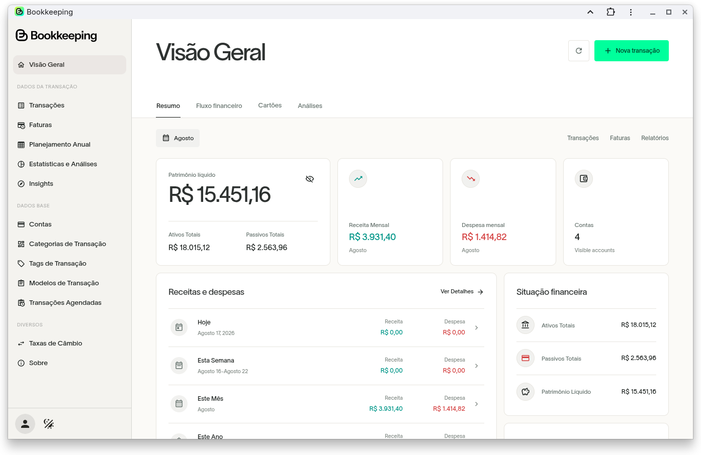
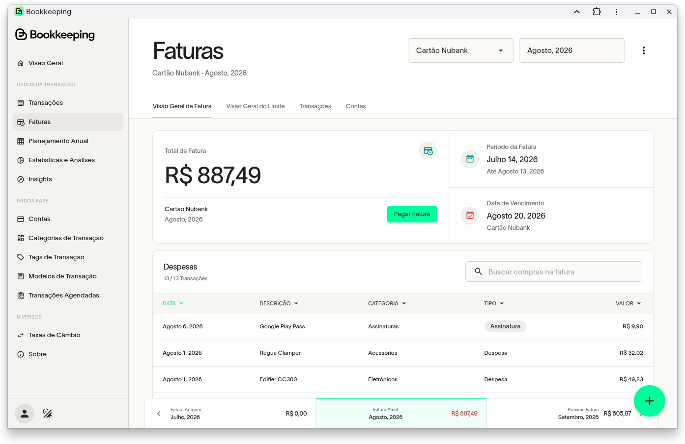
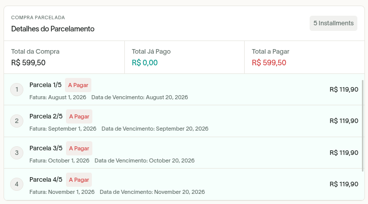
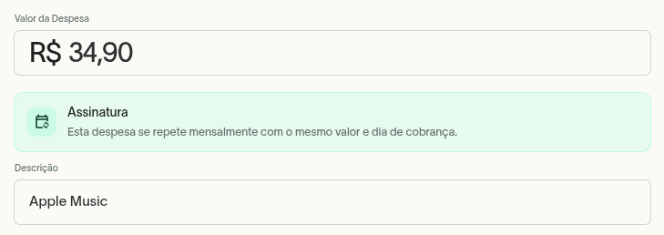
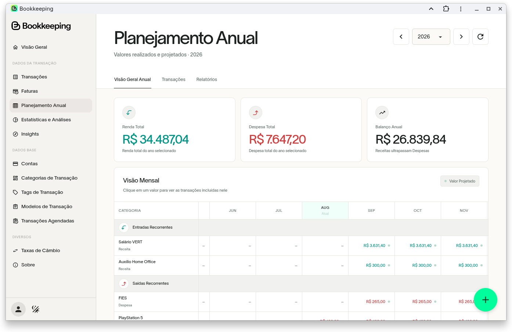

<p align="center">
  
</p>
<p align="center">
  
</p>


<br>

A fork of [ezBookkeeping](https://github.com/mayswind/ezbookkeeping), focused on an improved desktop experience and extended personal finance management features.

This fork builds upon the excellent foundation provided by ezBookkeeping while introducing a redesigned UI/UX and additional features for managing **credit cards, installments, subscriptions, invoices, and annual financial planning**.

> **Upstream project:** [mayswind/ezbookkeeping](https://github.com/mayswind/ezbookkeeping)

<br>

## About This Fork

Bookkeeping is a lightweight, self-hosted personal finance application designed to provide a clearer and more complete overview of everyday finances.

While retaining the core bookkeeping capabilities of ezBookkeeping, this fork expands the application with features commonly needed for personal financial management, particularly **credit card expenses and future financial commitments**.

The main additions include:

* Redesigned and enhanced UI/UX
* New financial overview dashboard
* Credit card invoice management
* Installment purchase tracking
* Recurring subscription management
* Annual financial planning
* Improved visualization of expenses, income, balances and upcoming commitments

The project remains fully self-hosted and can run on lightweight hardware, home servers, NAS devices and ARM-based systems.

<br>

## New Features

### Redesigned Home

The home page has been redesigned to provide a more useful financial overview at a glance.

The new interface provides quick access to:

* Account balances
* Income and expenses
* Cash flow
* Credit card usage
* Upcoming payments
* Recent transactions
* Financial reports
* Annual planning

The redesigned interface focuses on information density, readability and faster navigation while maintaining a clean desktop experience.

### Credit Card Management

This fork introduces expanded support for credit cards as part of the financial workflow.

Credit card accounts can be used to track:

* Current spending
* Available credit
* Credit limit
* Invoice periods
* Invoice totals
* Future installments
* Invoice payments

This makes credit card expenses visible as financial commitments instead of treating them only as ordinary transactions.

### Credit Card Invoices

<p align="center">
  
</p>

Credit card transactions are organized into invoice cycles, making it easier to understand exactly how much will need to be paid during each billing period.

Invoices provide a consolidated view of:

* Transactions belonging to the billing cycle
* Invoice total
* Installment purchases
* Recurring expenses
* Payment status

Invoices can also be marked as paid through a dedicated payment workflow.

When paying an invoice, Bookkeeping creates the corresponding transfer between the selected payment account and the credit card account, keeping account balances and transaction history consistent.

### Installment Purchases

<p align="center">
  
</p>

Purchases can be split into multiple installments.

Bookkeeping automatically tracks the installments and their impact on future credit card invoices, providing a more realistic view of committed credit.

This allows you to distinguish between:

* Amount already billed
* Current invoice spending
* Future installments
* Total credit currently committed

Installment purchases therefore remain visible beyond the current month instead of disappearing from the financial overview after the original transaction.

### Subscriptions

<p align="center">
  
</p>

Recurring subscriptions can be tracked separately from ordinary transactions.

This provides a clearer picture of recurring financial commitments such as:

* Streaming services
* Cloud services
* Software subscriptions
* Memberships
* Other recurring expenses

Subscriptions can be considered independently from installment purchases when calculating future credit card commitments.

### Annual Planning

<p align="center">
  
</p>

The Annual Planning view provides a broader perspective of your finances across the entire year.

Instead of analyzing finances exclusively month by month, the annual view makes it easier to understand:

* Monthly income
* Monthly expenses
* Net monthly results
* Spending trends
* Recurring commitments
* Future expenses
* Overall yearly financial performance

This is particularly useful for identifying long-term spending patterns and anticipating months with higher financial commitments.

<br>

## Original ezBookkeeping Features

All core ezBookkeeping functionality remains available, including:

* Open source and self-hosted deployment
* Lightweight resource usage
* SQLite, MySQL and PostgreSQL support
* Docker deployment
* x86, AMD64 and ARM support
* Desktop and mobile interfaces
* Progressive Web App (PWA) support
* Dark mode
* Two-level accounts and categories
* Transaction attachments
* Scheduled transactions
* Advanced filtering and search
* Reports and data visualization
* Multi-language support
* Multi-currency support
* Automatic exchange rates
* Multiple time zones
* Two-factor authentication
* OIDC authentication
* Application lock
* CSV, OFX, QFX, QIF, IIF and other import formats

For the complete upstream feature set, see the [official ezBookkeeping documentation](https://ezbookkeeping.mayswind.net/features/).

<br>

## Installation

### Docker

Docker is the recommended way to run Bookkeeping (currently available only for ARM64 devices):

```bash
docker run -d \
  --name bookkeeping \
  -p 8080:8080 \
  ghcr.io/jobsrobson/ezbookkeeping-plus:2.0.0-arm64
```

Bookkeeping will be available at:

```text
http://localhost:8080
```

Persistent volumes should be configured for production deployments according to your environment.

### Build from Source

The project requires:

* Go
* GCC
* Node.js
* NPM
* Docker (optional)

Clone the repository:

```bash
git clone https://github.com/jobsrobson/ezbookkeeping.git
cd ezbookkeeping
```

Build the application:

```bash
./build.sh package -o ezbookkeeping.tar.gz
```

You can also build a Docker image:

```bash
./build.sh docker
```

<br>

## Technology

Bookkeeping retains the architecture of the upstream ezBookkeeping project.

The application consists of a web frontend and a Go backend and supports multiple database engines, including:

* SQLite
* MySQL
* PostgreSQL

It can be deployed on traditional Linux servers, containers, NAS devices and lightweight ARM systems.

<br>

## Upstream Project

This project is a fork of **ezBookkeeping**, created and maintained by [mayswind](https://github.com/mayswind).

Original project:

[github.com/mayswind/ezbookkeeping](https://github.com/mayswind/ezbookkeeping)

Official documentation:

[ezbookkeeping.mayswind.net](https://ezbookkeeping.mayswind.net)

The upstream project provides the core bookkeeping engine, transaction management, accounts, reports, localization, authentication and many other features on which this fork is based.

<br>

## Fork Goals

The goal of this fork is not to replace the upstream project, but to extend it toward a more comprehensive personal finance workflow.

Development is primarily focused on:

1. Improving desktop UI/UX
2. Making credit card spending easier to understand
3. Properly representing installment purchases
4. Tracking recurring financial commitments
5. Providing better visibility into future expenses
6. Expanding financial planning beyond the current month
7. Maintaining the lightweight and self-hosted nature of ezBookkeeping

<br>

## Contributing

This fork is primarily developed around its extended personal finance features.

Bug reports, improvements and suggestions are welcome through GitHub Issues and Pull Requests.

For issues related to functionality inherited directly from ezBookkeeping, please verify whether the issue also exists in the upstream project before reporting it here.

<br>

## Credits

Bookkeeping is based on [ezBookkeeping](https://github.com/mayswind/ezbookkeeping), an open-source personal finance application created by **mayswind** and its contributors.

A significant portion of the application's architecture and core functionality originates from the upstream project.

Thanks to all ezBookkeeping contributors for building and maintaining the foundation that made this fork possible.

<br>

## License

This project follows the license of the upstream ezBookkeeping project.

[MIT License](https://github.com/mayswind/ezbookkeeping/blob/master/LICENSE)
